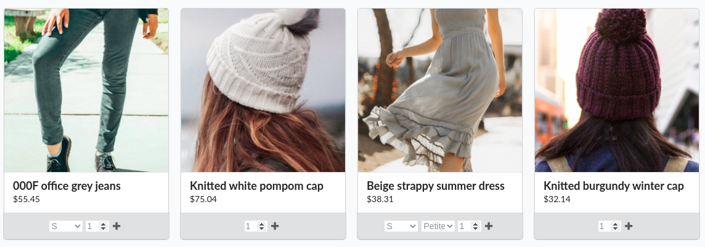

<div class="repo-badge inline-block vertical-align">
  <a title="Latest push build on default branch: passed" name="status-images" class="pointer open-popup">
    
  </a>
</div>
<br />
This plugin adds a small form to each and every product card in the shop. The form allows customers to add products to
their cart without having to visit the product detail and cart summary page.



As can be seen in the image above, this works best when using the "match" product variant selection method. Please see the
official Sylius documentation on how to setup the product variant selection method in the shop.

##### Supported Sylius versions:
<table>
    <tr><td>1.6</td></tr>
</table>


> **_NOTE:_** *This plugin requires PHP 7.4 or up*

#### Installation:
1. Install using composer:
    ```bash
    composer require nedac/sylius-order-now-plugin
    ```

2. Register bundle:
    ```php
    <?php
    # config/bundles.php
    return [
        # ...
        Nedac\SyliusOrderNowPlugin\NedacSyliusOrderNowPlugin::class => ['all' => true],
    ];
    ```

3. If you have **overridden** the `ProductAssociation`, `Product` and/or `ProductReview` controller in
your project, please make sure they use the corresponding trait:
    - `ProductAssociation` -> `Nedac\SyliusOrderNowPlugin\Controller\ProductAssociationControllerTrait`
    - `Product` -> `Nedac\SyliusOrderNowPlugin\Controller\ProductControllerTrait`
    - `ProductReview` -> `Nedac\SyliusOrderNowPlugin\Controller\ProductReviewTrait`
    > **_NOTE:_** *If the methods in the traits have already been implemented in the controller in your project then the logic will have to be merged.*

4. If you have overridden controllers in your project and you've gone through step 3, please do not change your Sylius
configuration for those controllers. Otherwise:
    ```yaml
    # config/packages/_sylius.yaml

    # ...

    sylius_product:
        resources:
            product:
                classes:
                    controller: Nedac\SyliusOrderNowPlugin\Controller\ProductController
            product_association:
                classes:
                    controller: Nedac\SyliusOrderNowPlugin\Controller\ProductAssociationController

    # ...

    sylius_review:
        resources:
            product:
                review:
                    classes:
                        controller: Nedac\SyliusOrderNowPlugin\Controller\ProductReviewController
    ```

5. Make the plugins route available:
    ```yaml
    # config/routes/sylius_shop.yaml

    # ...

    nedac_sylius_order_now_plugin:
        resource: '@NedacSyliusOrderNowPlugin/Resources/config/shop_routing.yml'
    ```

6. When using Sylius 1.7, add/override templates like below (if on Sylius 1.6 skip this step):
    ```twig
    {# templates/bundles/SyliusShopBundle/Homepage/_carousel.html.twig #}

    <div class="carousel-wrapper">
        <div class="carousel">
            
                <div class="carousel-item">
                    
                </div>
            
        </div>

        <div class="carousel-nav">
            <button class="carousel-left ui huge black icon button">
                <i class="left arrow icon"></i>
            </button>
            <button class="carousel-right ui huge black icon button">
                <i class="right arrow icon"></i>
            </button>
        </div>
    </div>
    ```
    ```twig
    {# templates/bundles/SyliusShopBundle/Homepage/_list.html.twig #}

    
        
    
    
        
    

    <div class="ui {{ columns|default('') }} cards">
        
            
        
    </div>
    ```
    ```twig
    {# templates/bundles/SyliusShopBundle/Product/Box/_content.html.twig #}

    

    

    

    <div class="ui fluid card" {{ sylius_test_html_attribute('product') }}>
        <a href="{{ path('sylius_shop_product_show', {'slug': product.slug, '_locale': product.translation.locale}) }}" class="blurring dimmable image">
            <div class="ui dimmer">
                <div class="content">
                    <div class="center">
                        <div class="ui inverted button">{{ 'sylius.ui.view_more'|trans }}</div>
                    </div>
                </div>
            </div>
            
        </a>
        <div class="content" {{ sylius_test_html_attribute('product-content') }}>
            <a href="{{ path('sylius_shop_product_show', {'slug': product.slug, '_locale': product.translation.locale}) }}" class="header sylius-product-name" {{ sylius_test_html_attribute('product-name', product.name) }}>{{ product.name }}</a>
            
                <div class="sylius-product-price" {{ sylius_test_html_attribute('product-price') }}>{{ money.calculatePrice(product|sylius_resolve_variant) }}</div>
            
        </div>
        <div class="ui bottom attached button nedac-order-now-button-container">
            {{ form_start(cardForm, {'action': path('nedac_shop_cart_add_item', {'productId': product.id}), 'attr': {'id': formId, 'novalidate': 'novalidate'}}) }}
            {{ form_row(cardForm.cartItem.quantity) }}
            
                
                    
                
                    
                
            
            <i class="add icon"></i>
            {{ form_end(cardForm) }}
        </div>
    </div>
    ```
    ```twig
    {# templates/bundles/SyliusShopBundle/Product/Index/_main.html.twig #}

    
    

    {{ sylius_template_event('sylius.shop.product.index.search', _context) }}

    <div class="ui clearing hidden divider"></div>

    {{ sylius_template_event('sylius.shop.product.index.before_list', {'products': resources.data}) }}

    
        <div class="ui three cards" id="products" {{ sylius_test_html_attribute('products') }}>
            
                
            
        </div>
        <div class="ui hidden divider"></div>

        {{ sylius_template_event('sylius.shop.product.index.before_pagination', {'products': resources.data}) }}

        {{ pagination.simple(resources.data) }}
    
        {{ messages.info('sylius.ui.no_results_to_display') }}
    
    ```
    ```twig
    {# templates/bundles/SyliusShopBundle/Product/_box.html.twig #}

    {{ sylius_template_event('sylius.shop.product.index.box', {'product': product, 'cardForm': cardForm}) }}
    ```
    ```twig
    {# templates/bundles/SyliusShopBundle/Product/_horizontalList.html.twig #}

    <div class="ui four doubling cards">
        
            
        
    </div>
    ```
    ```twig
    {# templates/form/product_card_form_theme.html.twig #}

    
    

    
        <input class="nedac-sylius-order-now-plugin-number-input" type="number" name="{{ full_name }}" value="1" min="1" />
    

    
        
            
        
        <select class="nedac-sylius-order-now-plugin-dropdown" name="{{ full_name }}"  multiple="multiple">
            
                <option value="" selected="selected">{{ placeholder != '' ? (translation_domain is same as(false) ? placeholder : placeholder|trans({}, translation_domain)) }}</option>
            
            
                
                
                {{- block('choice_widget_options') -}}
                
                    <option disabled="disabled">{{ separator }}</option>
                
            
            
            
            {{- block('choice_widget_options') -}}
        </select>
    

    
        {{- form_widget(form) -}}
        {{- form_errors(form) -}}
    

    
        
            {{ form_errors(form) }}
        
        {{- block('form_rows') -}}
        {{- form_rest(form) -}}
    
    ```
    ```twig
    {# templates/Product/Show/_options.html.twig #}

    
        {{ form_row(option_form, { 'attr': { 'data-option': option_form.vars.name } }) }}
    
    ```
    ```twig
    {# templates/Product/Show/_variants.html.twig #}

    

    <table class="ui single line small table" id="sylius-product-variants">
        <thead>
        <tr>
            <th>{{ 'sylius.ui.variant'|trans }}</th>
            <th>{{ 'sylius.ui.price'|trans }}</th>
            <th></th>
        </tr>
        </thead>
        <tbody>
        
            <tr>
                <td>
                    {{ variant.name }}
                    
                        <div class="ui horizontal divided list">
                            
                                <div class="item">
                                    {{ optionValue.value }}
                                </div>
                            
                        </div>
                    
                </td>
                <td class="sylius-product-variant-price">{{ money.calculatePrice(variant) }}</td>
                <td class="right aligned">
                    {{ form_widget(cardForm.cartItem.variant[key], {'label': false}) }}
                </td>
            </tr>
        
        </tbody>
    </table>
    ```

7. If on Sylius 1.6, add/override templates as follows (if on Sylius 1.7 skip this step):
    ```twig
    {# templates/bundles/SyliusShopBundle/Product/Index/_main.html.twig #}

    
    

    {{ sonata_block_render_event('sylius.shop.product.index.before_search', {'products': resources.data}) }}

    

    {{ sonata_block_render_event('sylius.shop.product.index.after_search', {'products': resources.data}) }}

    
    

    <div class="ui clearing hidden divider"></div>

    {{ sonata_block_render_event('sylius.shop.product.index.before_list', {'products': resources.data}) }}

    
        <div class="ui three cards" id="products">
            
                
            
        </div>
        <div class="ui hidden divider"></div>

        {{ sonata_block_render_event('sylius.shop.product.index.before_pagination', {'products': resources.data}) }}

        {{ pagination.simple(resources.data) }}
    
        {{ messages.info('sylius.ui.no_results_to_display') }}
    
    ```
    ```twig
    {# templates/bundles/SyliusShopBundle/Product/_box.html.twig #}

    

    {{ sonata_block_render_event('sylius.shop.product.index.before_box', {'product': product}) }}

    

    

    <div class="ui fluid card">
        <a href="{{ path('sylius_shop_product_show', {'slug': product.slug, '_locale': product.translation.locale}) }}" class="blurring dimmable image">
            <div class="ui dimmer">
                <div class="content">
                    <div class="center">
                        <div class="ui inverted button">{{ 'sylius.ui.view_more'|trans }}</div>
                    </div>
                </div>
            </div>
            
        </a>
        <div class="content">
            <a href="{{ path('sylius_shop_product_show', {'slug': product.slug, '_locale': product.translation.locale}) }}" class="header sylius-product-name">{{ product.name }}</a>
            
                <div class="sylius-product-price">{{ money.calculatePrice(product|sylius_resolve_variant) }}</div>
            
        </div>
        <div class="ui bottom attached button nedac-order-now-button-container">
            {{ form_start(cardForm, {'action': path('nedac_shop_cart_add_item', {'productId': product.id}), 'attr': {'id': formId, 'novalidate': 'novalidate'}}) }}
                {{ form_row(cardForm.cartItem.quantity) }}
                
                    
                        
                    
                        
                    
                
                <i class="add icon"></i>
            {{ form_end(cardForm) }}
        </div>
    </div>

    {{ sonata_block_render_event('sylius.shop.product.index.after_box', {'product': product}) }}
    ```
    ```twig
    {# templates/bundles/SyliusShopBundle/Product/_horizontalList.html.twig #}

    <div class="ui four doubling cards">
        
            
        
    </div>
    ```
    ```twig
    {# templates/form/product_card_form_theme.html.twig #}

    
    

    
        <input class="nedac-sylius-order-now-plugin-number-input" type="number" name="{{ full_name }}" value="1" min="1" />
    

    
        
            
        
        <select class="nedac-sylius-order-now-plugin-dropdown" name="{{ full_name }}"  multiple="multiple">
            
                <option value="" selected="selected">{{ placeholder != '' ? (translation_domain is same as(false) ? placeholder : placeholder|trans({}, translation_domain)) }}</option>
            
            
                
                
                {{- block('choice_widget_options') -}}
                
                    <option disabled="disabled">{{ separator }}</option>
                
            
            
            
            {{- block('choice_widget_options') -}}
        </select>
    

    
        {{- form_widget(form) -}}
        {{- form_errors(form) -}}
    

    
        
            {{ form_errors(form) }}
        
        {{- block('form_rows') -}}
        {{- form_rest(form) -}}
    
    ```
    ```twig
    {# templates/Product/Show/_options.html.twig #}

    
        {{ form_row(option_form, { 'attr': { 'data-option': option_form.vars.name } }) }}
    
    ```
    ```twig
    {# templates/Product/Show/_variants.html.twig #}

    

    <table class="ui single line small table" id="sylius-product-variants">
        <thead>
        <tr>
            <th>{{ 'sylius.ui.variant'|trans }}</th>
            <th>{{ 'sylius.ui.price'|trans }}</th>
            <th></th>
        </tr>
        </thead>
        <tbody>
        
            <tr>
                <td>
                    {{ variant.name }}
                    
                        <div class="ui horizontal divided list">
                            
                                <div class="item">
                                    {{ optionValue.value }}
                                </div>
                            
                        </div>
                    
                </td>
                <td class="sylius-product-variant-price">{{ money.calculatePrice(variant) }}</td>
                <td class="right aligned">
                    {{ form_widget(cardForm.cartItem.variant[key], {'label': false}) }}
                </td>
            </tr>
        
        </tbody>
    </table>
    ```

8. Install assets:
    ```bash
    bin/console sylius:install:assets
    ```

It might be necessary to clear the cache after installation:
```bash
bin/console cache:clear
```

The plugin should now be successfully installed.

#### Setup development environment:
```bash
docker-compose build
docker-compose up -d
docker-compose exec php composer --working-dir=/srv/sylius install
docker-compose run --rm nodejs yarn --cwd=/srv/sylius/tests/Application install
docker-compose run --rm nodejs yarn --cwd=/srv/sylius/tests/Application build
docker-compose exec php bin/console assets:install public
docker-compose exec php bin/console doctrine:schema:create
docker-compose exec php bin/console sylius:fixtures:load -n
```
#### Running tests:
```bash
docker-compose exec php sh
bin/console doc:sche:cre
cd ../..
vendor/bin/phpcs
vendor/bin/phpstan analyse src/ --level max
vendor/bin/phpunit
vendor/bin/behat
```
